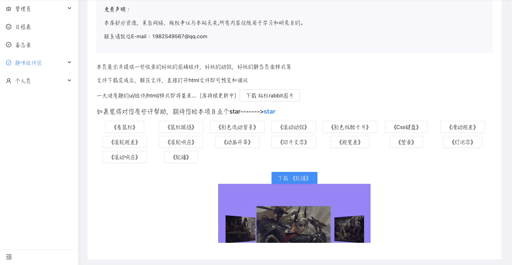

**MP_V2项目地址**：[github 地址](https://github.com/SSDWGG/MP_V2.git)

# MP_V2
[项目在线地址](http://ssdwgg.xyz:2231)

### 前言

这是一个多功能集合的项目，该项目主要基于 ant design pro 框架

前台使用 ant design pro 为基础开发
服务端 使用 springboot 来启服务

项目启动方式：
1.在 mysql 数据库中建立数据库（库名：MP_V2），导入 sql 文件

2.后端配置数据库：进入application.properties文件夹中修改设置（默认使用端口为3306  默认数据库MP_V2 默认账号root 默认密码123456）请根据你的实际情况修改


3.服务端启动 ：正常java启动 接口端口默认开启为9050

4.前端启动 ： 进入 antpro 文件夹 使用 npm install 安装依赖 使用 npm start 启动 打开localhost:8000页面

5.登录注册：注册一个用户，然后使用账号密码登录


（项目中的上传下载功能，需要根据不同的服务器调整，如果有问题欢迎提问）
项目启动出现任何问题可以联系VX： 13616549486，或者发起提问。本项目持续更新开发中...
<br/>

### 1.项目截图



<br/>

### 2.项目功能列举

现有的项目功能
- [x] 用户注册功能
- [x] 用户登录功能
- [x] 使用 jwt 完成账号的权限验证
- [x] 日程表功能（todoList）
- [x] 用户个性化配置（头像，信息，系统页面配置等）
- [x] 备忘录功能
- [x] 管理员管理功能（权限管理类的）
- [x] 趣味组件库（作者收录的一些有趣的页面和组件的代码，可下载）

计划将会开发的功能
- socket聊天室功能
- 音乐播放器功能
- 一些其他的定制功能


<br/>

### 3.功能模块介绍
- [x] 用户注册功能  ，按照表单填写信息即可，用户名这里我用了一个重复性校验。如果用户名已经被使用，会有提示。邮箱注册暂未开放验证码，如果有需要可以参考我的rabbitmall项目中的注册，使用到了邮箱验证注册的功能

- [x] 用户登录功能 ， 填写用户名和密码，后台通过校验会返回一个token，前端将token存放在浏览器中，并且在请求拦截器中，加入这个token到头部，后端会校验token是否可用
[springboot整合jwt 技术参考](https://blog.csdn.net/weixin_46195957/article/details/115326648)
（登录注册模块的接口token验证放开，其余接token后端需要开启token验证）


- [x] 日程表todolist功能 ： 

头部展示了一些用户信息，如果想修改这些用户信息，可以在用户信息模块修改配置

搜索栏有三个搜索项，任务标题，任务分类，任务进行状态

表格主体使用的是protable来实现的，这里包含了两张表格（分页显示和拖拽排序显示），因为两者是不兼容的，可以点击切换

表格中的一些时间项可以用来排序（在表头部分）

- [x] 个人信息展示和配置功能：

子页面1：个人卡片  展示了一些个人信息和个人标签组件


子页面2：配置项管理   在这个页面里面可以配置系统的多处信息，个人账号的一些账号密码修改。todo列表的一些配置


- [x] 备忘录功能：


- [x] 管理员管理功能：对于识别为管理员的用户会有一些特殊的权限页面，管理员的标识为users表中的admin字段   admin==1 为管理员


- [x] 趣味组件库功能：提供了大量的作者收录的有趣的html，css动效，codeopen，个人开发者，组件库等公开的组件，提供zip压缩包下载，并使用gif展示每个组件的预览和点击放大预览。库持续更新...


<br/>

### 4.部署
部署的话正常情况应该没什么问题，nginx代理用上，还是很好配置的。因为我用了统一的api头，所以直接上代理就行了。

贴下我的该项目的配置
```
server {
        listen       2231 default_server;   #端口
         server_name  _;
        root /home/www/MP_V2/dist;         #文件存储位置

         location /v2/{
        proxy_pass http://119.3.145.125:9050;
        proxy_set_header   X-Forwarded-Proto $scheme;
        proxy_set_header   X-Real-IP         $remote_addr;
        }
        location /{
               #资源访问失败后定向到index.html
            try_files $uri $uri/ /index.html;
        }
        error_page 404 /404.html;
            location = /40x.html {
       }
        error_page 500 502 503 504 /50x.html;
            location = /50x.html {
        }

        }
```

说一下图片文件的上传，我是直接传到服务器的指定位置的，如果你想部署使用该功能需要根据项目部署的实际路径改一下配置（前端upload组件和后端对应接口一起改下ip和存储地址），或者上云存储更加快速方便。
联系请致信E-mail：1982549567@qq.com